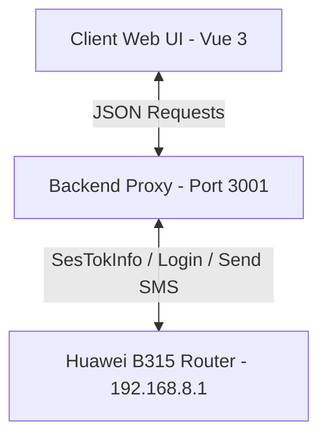

# Huawei Connect — B315 SMS Broadcast Portal

Huawei Connect is a professional SMS broadcasting web portal designed specifically for the **Huawei B315** (and compatible) 4G/LTE routers. It leverages the router's built-in SIM card and gateway API to send single and bulk text messages from a clean, modern web interface.

The application is structured into two main parts:
1. **Frontend Portal**: A Vue 3 + Vite application built using a premium glassmorphic interface and Ant Design Vue.
2. **Backend Proxy Server**: An Express.js API proxy that manages Huawei session validation, challenge-response logins (SHA-256 tokens), and API routing to avoid CORS issues.

---

## 🚀 Key Features

*   **Quick Send (Single SMS)**: Send instant text messages to any recipient number.
*   **Bulk Broadcasting**:
    *   **Contact File Uploads**: Support for **CSV** (with `name` and `phone` columns), **VCF** (vCards), and plain **TXT** formats.
    *   **Personalization Templates**: Use `{name}` in your messages to automatically inject each recipient's name dynamically.
    *   **Rate Limiting / Pacing**: Automatically pauses for `1` second between requests to ensure the router does not drop SMS payloads.
    *   **Live Progress Bar**: Displays overall progress, success/failure counts, and real-time status badges next to each contact.
*   **Persistent History Log**: Stores the log of sent single and bulk messages locally (persisted inside your browser's local storage) with an option to clear the logs.
*   **Seamless Login & Tokens Handling**: Automates security challenges, token management (`__RequestVerificationToken`), and session cookie handling required by Huawei's modern firmware.

---

## 🛠️ System Architecture



---

## 💻 How to Get Started

### Prerequisites
*   **Node.js** (v16 or higher recommended)
*   **Huawei B315 Router** (powered on, connected to the host PC via Ethernet/Wi-Fi, and containing a valid SIM card)

---

### Step 1: Set Up & Run the Backend Proxy

The backend proxy handles CORS headers and the multi-step Huawei Authentication token exchange.

1. Navigate to the backend directory:
   ```bash
   cd backend
   ```
2. Install the backend dependencies:
   ```bash
   npm install
   ```
3. Start the backend server:
   *   **For production/normal execution**:
       ```bash
       npm start
       ```
   *   **For development (auto-reload via nodemon)**:
       ```bash
       npm run dev
       ```
   
   The backend will start listening on **http://localhost:3001**.

---

### Step 2: Set Up & Run the Frontend

1. Navigate back to the project root directory:
   ```bash
   cd ..
   ```
2. Install the frontend dependencies:
   ```bash
   npm install
   ```
3. Launch the development server:
   ```bash
   npm run dev
   ```
   
   The web portal will run locally (usually on **http://localhost:5173**). Open this URL in your web browser.

---

### Step 3: Configure and Send

1. **Router Details**: Under the **Router Configuration** card, enter:
   *   **Router IP**: The IP address of your router dashboard (default is `192.168.8.1`).
   *   **Username**: Your router login username (default is `admin`).
   *   **Password**: Your router login password (typically configured during your router setup).
2. **Send Single SMS**: Use the **Quick Send** tab, enter a phone number and message, and click **Send**.
3. **Send Bulk SMS**:
   *   Go to **Bulk Broadcast**.
   *   Drag and drop your contacts file (CSV/VCF/TXT).
   *   Write your template (e.g., `Hello {name}, your code is 1234`).
   *   Click **Start Broadcast**.

---

## 📁 Project Structure

```text
├── backend/
│   ├── server.js          # Express proxy server
│   ├── package.json       # Backend configuration & packages
│   └── node_modules/      # Installed server modules
│
├── src/
│   ├── assets/            # Static assets
│   ├── components/        # Reusable Vue components
│   ├── App.vue            # Main application workspace & logic
│   ├── main.js            # App bootstrapping
│   └── style.css          # Customized CSS rules and glassmorphism styling
│
├── index.html             # Application entry point
├── package.json           # Frontend packages & scripts
└── vite.config.js         # Vite configuration settings
```

---

## 🔒 Under the Hood: Authentication Protocol

The B315 security requires a custom handshake:
1. Retrieve initial session cookie and verification token from `http://<router-ip>/api/webserver/SesTokInfo`.
2. Hash password: `SHA256(username + SHA256(password) + TokInfo)`.
3. POST username, password hash, and the tokens to the router login API.
4. Extrapolate new verification tokens (`__requestverificationtoken`) and cookie headers returned from the login response to authorize the final SMS payload transmission.

